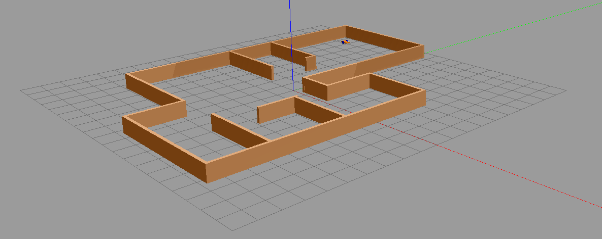

[Research Track I](https://corsi.unige.it/en/off.f/2021/ins/51201)<br>
**Programmer:** [Ankur Kohli](https://github.com/ankurkohli007)<br>
[M.Sc Robotics Engineering](https://corsi.unige.it/corsi/10635)<br>
[University of Genoa (UniGe)](https://unige.it/en)<br>
**Supervisor:** [Prof. Carmine Tommaso Recchiuto](https://rubrica.unige.it/personale/UkNDWV1r)

# Assignment 3: Software Architecture for Mobile Robot Control

## Abstract
This assignment is the ***development of a software architecture for the control of a mobile robot***. This is also based on how to control the robot using [ROS](https://www.ros.org/) (Robot Operating System), [Gazebo and RViz](https://classic.gazebosim.org/tutorials?tut=ros_installing&cat=connect_ros). The assignment consists in writing ROS nodes: a controller for a robot, and a UI. For this, ***Python*** programing is used. 

## Introduction
A robot moves in an environment initially unknown to it. The software architecture is developed to control the robot. The software will rely on the *move_base and gmapping packages* for localizing the robot and plan the motion. The architecture should be able to get the user request, and let the robot execute one of the following behaviors (depending on the user’s input) as follows:

* Autonomously reach a x,y coordinate inserted by the user
* Let the user drive the robot with the keyboard, 
* Let the user drive the robot assisting them to avoid collisions. 

Thanks to laser scanners mounted on board the robot, it is able to build a map of the environment and move without encountering obstacles. 

## Objective
The architecture should be able to get the user request, and let the robot execute robot behvaiour such as ***autonomous drive***, ***manual drive using teleop***, and ***manual drive using teleop and avoiding the collisions***. The user have the ability to control and change the robot behaviour using `master_control.py` node. The following operations give the ability to user to control the robot:

**Robot's Behaviour options**
* **Press 1** for Autonomously driving robot to reach at x,y coordinates as per input by the user 
* **Press 2** for Teleop operations by the user drive the robot using keyboard
* **Press 3** Obstacle avoidance operations to drive the robot assisting them (using keyboard) to avoid collisions 
* **Press 0** for Lazy state of robot, in this state robot will shows laziness and do nothing untill and unless the robots's behvaiour is chnaged by the user
* anything else : *stop*
* **Press q/z** for accelerate/decelrate velocity by 10%
* **Press w/x** for accelerate/decelrate only linear velocity by 10%
* **Press e/c** for accelerate/decelrate only angular velocity by 10%
* **Press CTRL-C** for to quit operations

## Gazebo & RViz

The assignment package will be tested on a simulation of a mobile robot driving inside of a given environment. The simulation and visualization are run by the two following modes:

* **Gazebo Envrionment**: Gazebo is an open-source 3D robotics simulator. It integrated the ODE physics engine, OpenGL rendering, and support code for sensor simulation and actuator control.

Gazebo can use multiple high-performance physics engines, such as ODE, Bullet, etc. (the default is ODE). It provides realistic rendering of environments including high-quality lighting, shadows, and textures. It can model sensors that "see" the simulated environment, such as laser range finders, cameras (including wide-angle), Kinect style sensors, and so on. 

For 3D rendering, Gazebo uses the OGRE engine. *(source from: [Wikipedia](https://en.wikipedia.org/wiki/Gazebo_simulator))*.

 

Figure above shows the view of ***Gazebo Environment***.

* **RViz Visualization World**: *RViz* is a tool for ROS Visualization. It's a 3D visualization tool for ROS. It allows the user to view the simulated robot model, log sensor information from the robot's sensors, and replay the logged sensor information. By visualizing what the robot is seeing, thinking, and doing, the user can debug a robot application from sensor inputs to planned (or unplanned) actions.

 

Figure above shows the view of ***RViz Visualization World***.

## Installing & Running

###### Installation

For this assignment, simulation requires [ROS Noetic](https://wiki.ros.org/noetic/Installation),  which is a set of software libraries and tools that help you build robot applications. 

Also, simulator requires **slam_gmapping** package, install it before using the package here presented! [Link to install slam_gmapping package](https://github.com/CarmineD8/slam_gmapping.git). 

Furthermore, simulator requires [Gazebo and RViz](https://classic.gazebosim.org/tutorials?tut=ros_installing&cat=connect_ros), check that is already installed these two or not. Anyway you can check every release of ROS in this [link](http://wiki.ros.org/ROS/Installation).

Another tool to be installed is the **xterm interface**. It is used to make the user experience more comfortable, so to install this execute the following command:
```
sudo apt-get install -y xterm
```
Once you have installed ROS, related tools and xterm, now build the workspace where packages installed.

After installing ROS Noetic on your system clone the [Prof. Carmine Tommaso Recchiuto](https://github.com/CarmineD8/final_assignment). After downloading the repository, you should take the `final_assignment` directory included in the repo and place it inside the local workspace directory. This repository contains the main workspace for running the simulation world.

The *Python* scripts, developed define a **user interface node** which let the user to control and change the robot behaviour according to their choice.

The **python scripts** developed during the assignment to accomplish the task are as foolows: 

* **master_control.py:** This python script will represents a  **Robot's Behaviour options** where the user can switch between robot's operations.

* **autonomous_drive.py:** This python script implements an *Action* client-service communication that will manage to drive the robot to a chosen position in the given environment.

* **teleop_operation.py:** This python script will let the user directly drive the robot with keyboard inputs known as **teleop operations**

* **obstacle_avoidance.py:** This last python script have an ability to avoid obstacle during performing task. Also, custom message `Avoid.msg` is used. This added feature will prevent the user to drive the robot into a wall.


