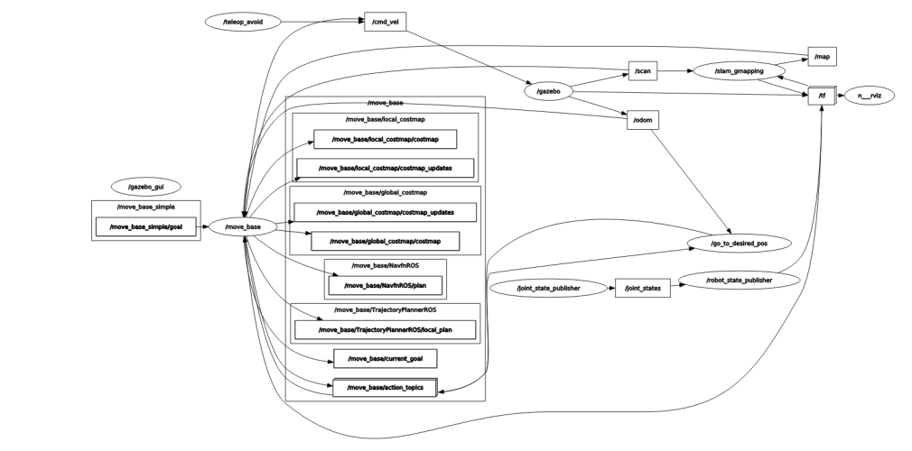

[Research Track I](https://corsi.unige.it/en/off.f/2021/ins/51201)<br>
**Programmer:** [Ankur Kohli](https://github.com/ankurkohli007)<br>
[M.Sc Robotics Engineering](https://corsi.unige.it/corsi/10635)<br>
[University of Genoa (UniGe), Italy](https://unige.it/en)<br>
**Supervisor:** [Prof. Carmine Tommaso Recchiuto](https://rubrica.unige.it/personale/UkNDWV1r)

# Assignment 3: Software Architecture for Mobile Robot Control

You can also view the ***Sphinx Documentation*** of this assignment from the *url* https://ankurkohli007.github.io/Research_Track_II_Assignment_1_Documentation_Sphinx/.

## Abstract
This assignment is the ***development of a software architecture for the control of a mobile robot***. This is also based on how to control the robot using [ROS](https://www.ros.org/) (Robot Operating System), [Gazebo and RViz](https://classic.gazebosim.org/tutorials?tut=ros_installing&cat=connect_ros). The assignment consists in writing ROS nodes: a controller for a robot, and a UI. For this, ***Python*** programing is used. 

## Introduction
A robot moves in an environment initially unknown to it. The software architecture is developed to control the robot. The software will rely on the *move_base and gmapping packages* for localizing the robot and plan the motion. The architecture should be able to get the user request, and let the robot execute one of the following behaviors (depending on the user’s input) as follows:

* Autonomously reach a x,y coordinate inserted by the user
* Let the user drive the robot with the keyboard, 
* Let the user drive the robot assisting them to avoid collisions. 

Thanks to laser scanners mounted on board the robot, it is able to build a map of the environment and move without encountering obstacles. 

## Objective
The architecture should be able to get the user request, and let the robot execute robot behvaiour such as ***autonomous drive***, ***manual drive using teleop***, and ***manual drive using teleop and avoiding the collisions***. The user have the ability to control and change the robot behaviour using `master_control.py` node. The following operations give the ability to user to control the robot:

**Robot's Behaviour options**
* **Press 1** for Autonomously driving robot to reach at x,y coordinates as per input by the user 
* **Press 2** for Teleop operations by the user drive the robot using keyboard
* **Press 3** Obstacle avoidance operations to drive the robot assisting them (using keyboard) to avoid collisions 
* **Press 0** for Lazy state of robot, in this state robot will shows laziness and do nothing untill and unless the robots's behvaiour is chnaged by the user
* anything else : *stop*
* **Press q/z** for accelerate/decelrate velocity by 10%
* **Press w/x** for accelerate/decelrate only linear velocity by 10%
* **Press e/c** for accelerate/decelrate only angular velocity by 10%
* **Press CTRL-C** for to quit operations

## Gazebo & RViz

The assignment package will be tested on a simulation of a mobile robot driving inside of a given environment. The simulation and visualization are run by the two following modes:

* **Gazebo Envrionment**: Gazebo is an open-source 3D robotics simulator. It integrated the ODE physics engine, OpenGL rendering, and support code for sensor simulation and actuator control.

Gazebo can use multiple high-performance physics engines, such as ODE, Bullet, etc. (the default is ODE). It provides realistic rendering of environments including high-quality lighting, shadows, and textures. It can model sensors that "see" the simulated environment, such as laser range finders, cameras (including wide-angle), Kinect style sensors, and so on. 

For 3D rendering, Gazebo uses the OGRE engine. *(source from: [Wikipedia](https://en.wikipedia.org/wiki/Gazebo_simulator))*.

<p align="center">
  
</p>

<p align="center">
    <em>Gazebo Environment</em>
</p> 

Figure above shows the view of ***Gazebo Environment***.

* **RViz Visualization World**: *RViz* is a tool for ROS Visualization. It's a 3D visualization tool for ROS. It allows the user to view the simulated robot model, log sensor information from the robot's sensors, and replay the logged sensor information. By visualizing what the robot is seeing, thinking, and doing, the user can debug a robot application from sensor inputs to planned (or unplanned) actions.

<p align="center">
  
</p>

<p align="center">
    <em>RViz World</em>
</p> 

Figure above shows the view of ***RViz Visualization World***.

## Installing & Running

## Installation

For this assignment, simulation requires [ROS Noetic](https://wiki.ros.org/noetic/Installation),  which is a set of software libraries and tools that help you build robot applications. 

Also, simulator requires **slam_gmapping** package, install it before using the package here presented! [Link to install slam_gmapping package](https://github.com/CarmineD8/slam_gmapping.git). 

Furthermore, simulator requires [Gazebo and RViz](https://classic.gazebosim.org/tutorials?tut=ros_installing&cat=connect_ros), check that is already installed these two or not. Anyway you can check every release of ROS in this [link](http://wiki.ros.org/ROS/Installation).

Another tool to be installed is the **xterm interface**. It is used to make the user experience more comfortable, so to install this execute the following command:
```
sudo apt-get install -y xterm
```
Once you have installed ROS, related tools and xterm, now build the workspace where packages installed.

After installing ROS Noetic on your system clone the [Prof. Carmine Tommaso Recchiuto](https://github.com/CarmineD8/final_assignment). After downloading the repository, you should take the `final_assignment` directory included in the repo and place it inside the local workspace directory. This repository contains the main workspace for running the simulation world.

The *Python* scripts, developed define a **user interface node** which let the user to control and change the robot behaviour according to their choice.

The **python scripts** developed during the assignment to accomplish the task are as foolows: 

* **master_control.py:** This python script will represents a  **Robot's Behaviour options** where the user can switch between robot's operations.

* **autonomous_drive.py:** This python script implements an *Action* client-service communication that will manage to drive the robot to a chosen position in the given environment.

* **teleop_operation.py:** This python script will let the user directly drive the robot with keyboard inputs known as **teleop operations**

* **obstacle_avoidance.py:** This last python script have an ability to avoid obstacle during performing task. Also, custom message `Avoid.msg` is used. This added feature will prevent the user to drive the robot into a wall.

## Running the program

* After cloning the repository from the aforementioned *GitHub* link, copy the `final_assignment` folder which is included in the cloned repository and paste in the src folder which is inside local ROS workspace directory or else you can directly clone the aforementioned repository in your src folder of the local ROS workspace. 
* Now, back to your ROS worksapce folder, run the command ```catkin_make```. This command will build all the scripts in the package.
* After building, run rospack profile in order to refresh or update your packages. 
```
rospack profile
```
After executing the aforementioned commands, execute the simulation in an easy way in which two *launch files* were added to the package. 

* launch_nodes.launch: That will launch the previously mentioned nodes through the use of the *Xterm* terminal. It will also initialize some **parameters** that will be used by the nodes during execution.

* launch_files.launch: that will *include* all the launch files needed for running the whole simulation all at once.

After that, **execute the following roslaunch** command:
```
roslaunch final_assignment launch_files.launch
```
After launching, four different windows will open i.e. four consoles od Gazebo & RViz.

## Architecture of the code

To fullfill the requirement, four different nodes were designed inside the package, the simulation is managed by the simulation which was provided by the professor, essentially **to install slam_gmapping package**. Here is the idea behind the communication of the nodes:

<p align="center">
  
</p>

<p align="center">
    <em>Architecture of the task</em>
</p> 

Figure above shows the *logic of the code*. It shows that, user through the console of the *User Interface Node* which will decide the operation to change robot's behaviour, after that the robot will start it's operation and will show on the consoles of the operations the result of the task, wheter it was okay or if something is going wrong. Anyway, the most important part is to understand the usage of the operations.

## Description of the Nodes & their logics

### User Interface Node: master_control.py

The user interface node is a super easy node because it is used only to set the ROS parameters travelling through the nodes. The most important one is the integer ```active``` which is the one dedicated to the modality of the robot. The other two are the desired positions which are useful only for the first modality. **Three parameters** were added in the `launch_nodes.launch` file manage the different activation state of all the nodes involved in the project. Parameters are as follows:

* **Active**: This parameter manages the current state of the project's ROS node chain. Once the program is launched, the parameter is set to be in *Lazy state of robot* (0 states). In the beginning, one of the nodes will be in its active state. he user input will change the value of the parameter and all the nodes will either keep their current idle state or switch to a running state. An if-else statement inside every node manages this operation switch.
* **pos_x and pos_y**: Also, these two parameters are received by an input user managed in the UI node. Once the user selects the **first operation** the User Interface Node will also ask for an X and Y coordinate. This data represents the position we want the robot to go. If the user wants to stop the robot's motion, it is sufficient to either input another driving modality or set the project idle state.

Below is the pesudocode for the *master_control.py*

```
def main():
	command = input from user
	if command == 1
    Operation 1 initiates
    
	elif command == 2
    Operation 2 initiates

	elif command == 3
    Operation 3 initiates
    
	elif command == 0
    Operation 4 initiates
        
	else:
    Print: "Sorry!! Invalid input!!"
```
Below is the main() defination which shows the main steps in the user interface node:
```python
def main():
		
	f = False	
	while not rospy.is_shutdown(): 
		command = int(input('Benvenuti!! Please choose the operation to change robot behaviour'))	
							
		# OPERATION 1: AUTONOMOUS DRIVING MODE TO REACH AT X,Y COORDINATES (User's Desired Position)
		if command == 1:
		
			if f == True:
			     print("Sorry!! Cancelling the operation")
			     f = 0
				
			rospy.set_param('active', 0) # resetting robot's state
			
			# Displaying message for the user to know the actuale state of robot 
			print("Now robot is in operation 1 state, if you want to cancel robot's behaviour then press '0'!!")
			# Now asking the user to input the target position i.e. x,y coordinated where user want to move the robot
			print("Please, enter the target position (x,y coordinates) where you want to send the robot!!")
			pos_x = float(input("Please, enter X coordinate:"))	# Displaying message to input x coordinate
			pos_y = float(input("Please, enter Y coordinate: "))   # Displaying message to input y coordinate		
			
			# Setting parameter on the Parameter Server
			rospy.set_param('des_pos_x', pos_x)	
			rospy.set_param('des_pos_y', pos_y)	
			rospy.set_param('active', 1)		
			print("ROBOT is performing opertion 1")
			f = True
			
		# OPERATION 2: OBSTACLE OPERATION TO CHANGE ROBOT'S BEHAVIOUR USING KEYBOARD
		elif command == 2:
		

			if f == True:
			     print("Sorry!! Cancelling the operation")
			     f = False
						
			rospy.set_param('active', 2)   # Message to know robot's current state
			print("Now robot is performing Operation 2")
			
				
		# OPERATION 3: OBSTACLE OPERATION TO ASSIST ROBOT'S BEHAVIOUR USING KEYBOARD & AVOIDING COLLISION
		elif command == 3:
		
			if f == True:
			     print("Sorry!! Cancelling the operation")
			     f = False
				
			rospy.set_param('active', 3) 	# Message to know robot's current state
			print("Now robot is performing Operation 3")
				
		# OPERATION 4: LAZY STATE, ROBOT WILL NOT PERFORM ANY ACTION
		elif command == 0:
			
			if f == True:
			     print("Sorry!! Cancelling the operation")
			     f = False
				
			rospy.set_param('active', 0)   # Message to know robot's current state
			print("Now robot is performing Operation 4")	# Printing the actual state.
				
		else:
			
			print("Sorry!! Invalid input!! Please choose the coorect option to perform robot operations!")

# this is used to execute some code only if the file was run directly, and not imported.
if __name__ == '__main__':
	print(msg)
	main()
```
<p align="center">
  
</p>

<p align="center">
    <em>Master Control Script Architecture</em>
</p> 

Figure above shows the ***master_control.py architecture***.

<p align="center">
  
</p>

<p align="center">
    <em>Terminal of Master Control Script</em>
</p> 

Figure above shows the *master_control.py terminal*.

### Autonomous Drive Node: autonomous_drive.py

This is the operation 1 where the robot has to reach the target (set by user end in master_control.py) by itself.

The user interface node is the most elegant node because is based on *ROS Action*, all the miracles take place with help of below command:

```python
client = actionlib.SimpleActionClient('/move_base', MoveBaseAction)
```
The Action Client-Service communicate via a "ROS Action Protocol", which is built on top of ROS messages. The client and server then provide a simple API for users to request goals (on the client side) or to execute goals (on the server side) via function calls and callbacks. The *Actionclient* use the messages such as `MoveBaseAction` and `MoveBaseGoal`. the figure below shows a graphical rappresentation of the ROS-Action protocol: 

<p align="center">
  
</p>

<p align="center">
    <em>Graphical Representation of Action Client & Action Server</em>
</p> 

Figure above shows the *action client and action server graphical representation*. Figure source from [RESEARCH TRACK 1 course material](https://2021.aulaweb.unige.it/pluginfile.php/339049/mod_resource/content/0/researchtrack_class_6.pdf)

For the client and server to communicate, custom messages were defined on which they communicating. This defines the Goal, Feedback, and Result messages with which clients and servers communicate. Actionlib feature, an ActionServer will receives the goal message from an ActionClient. In this case, he goal is to move the robot's base position. The goal would be a MoveBaseGoal message that contains information about where the robot should move to in the world. For controlling all the robot positions in space, the goal would contain the target_pose parameters (stamp, orientation, target position, etc). Below is the code which demonstartes the client side of the action:

```python
def action_client_init():
	
	global client 
	global goal
	
	client = actionlib.SimpleActionClient('move_base',MoveBaseAction) # actionlib package provides a standardized interface for interfacing with preemptible tasks.
	
	client.wait_for_server() # Waits until the action server has started up and started istening for goals.
	
	goal = MoveBaseGoal() # goal messages initialized
	"""we'll send a goal to the robot to move forward""" 
	goal.target_pose.header.frame_id = "map" # goal message set
	goal.target_pose.header.stamp = rospy.Time.now()
	goal.target_pose.pose.orientation.w = 1.0
	
def CallBack_reset(event):
	
	if active_==1:
		print ("Gol time exceeded :" + str(event.current_real)+state)
		print("\n")
		print("ROBOT failed to reach the defined target location within a span of 40 seconds")
		print("\n")
		# Setting parameters on the parameters server
		rospy.set_param('active', 0)
```
The program will print the actual position on screen. The actual position is not received by the *action feedback* but from a subscription to the odometry topic `/odom`. 

```python
def CallBack_odometry(msg): 
	global position_
	position_ = msg.pose.pose.position    
```
<p align="center">
  
</p>

<p align="center">
    <em>Terminal of Master Autonomous Drive Script</em>
</p> 


Figure above shows the *autonomous_drive.py terminal*.

### Teleop Node: teleop_operation.py

The script is based on the standard ROS teleop_twist_keyboard.py. This node is constantly checking which keys are pressed on a PC keyboard and based on the pressed keys, publishes twist messages on the `/cmd_vel` topic. Twist message defines what should be the linear and rotational speeds of a mobile robot.


| Direction   |      Key      |
|----------|:-------------:|
| Straight |  'i/I' | 
| Right |    'l/L'   | 
| Left | 'j/J' |
| Back | 'k/K' |


The logic of the code is really simple, so decided to use the already existing code of the package ***teleop_twist_keyboard*** the code, is open to be realaborated on their github repository, here's the [link](http://wiki.ros.org/teleop_twist_keyboard), as we can see it's pretty easy and the things implemented in this is simple.

<p align="center">
  
</p>

<p align="center">
    <em>Terminal of Master Autonomous Drive Script</em>
</p> 

Figure above shows the *teleop_operation.py terminal*.

A **commands** to manages the keyboard input set by:
A commands are *python* unordered and changeable collection of data values that holds key-value pairs. Each key-value pair in the dictionary maps the key to its associated value making it more optimized. In the standard `teleop_twist_keyboard`, a command is used to collect the buttons for all the possible robot's movements. In my version of the node, some of these keys are omitted to code an easier implementation of the avoidance feature. The following instance is the dictionary used in the node:

```python
moveBindings = {
        'i':(1,0,0,0),
        'o':(1,0,0,-1),
        'j':(0,0,0,1),
        'l':(0,0,0,-1),
        'u':(1,0,0,1),
        'k':(-1,0,0,0),
        '.':(-1,0,0,1),
        'm':(-1,0,0,-1),
        'O':(1,-1,0,0),
        'I':(1,0,0,0),
        'J':(0,1,0,0),
        'L':(0,-1,0,0),
        'U':(1,1,0,0),
        'K':(-1,0,0,0),
        '>':(-1,-1,0,0),
        'M':(-1,1,0,0),
        't':(0,0,1,0),
        'b':(0,0,-1,0),
    }
```

A **commands** to control the speed are as follows:
```python
speedBindings={
        'q':(1.1,1.1),
        'z':(.9,.9),
        'w':(1.1,1),
        'x':(.9,1),
        'e':(1,1.1),
        'c':(1,.9),
    }
```
### Obstacle Avoidance Node: obstacle_avoidance.py

This node aims to activate a security feature for driving with the teleop_key modality. The **subscription** to the `/laser_scan` topic, the node will be able to get info about the robot's surroundings. The subscription to the topic will give back the `ranges[0,720]` array to the subscribed callback. This data structure contains the distance values between the robot and the surrounding walls for a span of 180º degrees in front of the robot. The array simulates the info that a set of lasers would retrieve in an actual environment.  The node will later elaborate the data acquired to publish it on the `custom_controller` custom topic through the `Avoid.msg` custom message.

`CallBack_avoid(msg)` is the callback function used to acquire and manage the data from the `/lase_scan` subscription. Once the callback retrieves the `ranges[]` array, the following 5 sub-ranges divide the data structure  as follows:
* From 0 to 143: which represents the right side of the scanned area.
* From 144 to 287: which represents the fron-right side of the scanned area.
* From 288 to 431: which represents the front side of the scanned area.
* From 431 to 575: which represents the front-left side of the scanned area.
* From 576 to 719: which represents the left side of the scanned area.

 

Figure above shows the *laser_scan* strucutre of the robot.

Below is the structure of `CallBack_avoid()`:
```python
def CallBack_avoid(msg):
       global l
       global r
       global f
	
	active_=rospy.get_param("/active") # Active parameters value is assigned to the local variables
	
	
	if active_ == 3:
		
		right = min(msg.ranges[0:143])	        # right checking laser span.
		front = min(msg.ranges[288:431])	# front checking laser span.
		left = min(msg.ranges[576:719])	# left checking laser span.
		
	      # robot is close to right wall.
		if right < 1.0:
			r = False
		else:
			r = True
	      
	      # robot is close to front wall
		if front < 1.0:
			f = False
		else:
			f = True
	      
	      # robot is close to left wall
		if left < 1.0:
			l = False
		else:
			l = False
	"""
	 If all the conditions are okay than Operation 3 "Obstacle avoidance operations to drive the robot assisting them (using keyboard) to avoid collisions" is stopped
	"""	
	
	else: 
		r = True
		f = True
		l = True
```
The `main` function is used only to initialize the publisher and the subscriber's instances and publish the avoidance message on the `custom_contrller` topic. The while loop will spin at a 10hz rate thanks to the `sleep` function. 

```python
def main():
        global l
        global r
        global f
	
	# Publishing
	pub = rospy.Publisher('custom_controller', Avoid, queue_size = 10)	
	rospy.init_node('avoidence') # node is initialized
	sub = rospy.Subscriber('/scan', LaserScan, CallBack_avoid) # /scan topic is subscribed
	rate = rospy.Rate(5) 
	
	pub_msg = Avoid() # custom message
	
        # The most common usage patterns for testing for shutdown in rospy
	while not rospy.is_shutdown():
	
		pub_msg.left = l    # custom message field is assigned for left wall
		pub_msg.right = r   # custom message field is assigned for right wall
		pub_msg.front = f   # custom message field is assigned for front wall
		
		# message fields is published
		pub.publish(pub_msg)		
		
		#rate.sleep() will dynamically choose the correct amount of time to sleep to respect the given frequency (delay of 10)
		rate.sleep()
		
#this is used to execute some code only if the file was run directly, and not imported
if __name__=="__main__":
	main()
```
The whole ROS nodes net is independent of this node. In case the node wouldn't start, the project would still execute fine.

## RQT Graph

`RQT` Graph run the following command: 
```
rosrun rqt_graph rqt_graph
```
 

Figure above shows the RQT Graph of Nodes Only.

 

Figure above shows the RQT Graph of Nodes Topics Active.

 

Figure above shows the RQT Graph of Nodes Topics All. 

## Process of the assignment


Figure above shows the *Assignment Process*.

## Performance of Mobile Robot Control


## Conclusion & Future Improvements

I'm satisfied with the final result, even if better improvements can be done.
First of all some parameters can be changed since they may be not optimal. Having said that, there are 2 particular improvenments that I want to highlight:

* In the assisted driving mode, the robot avoid obstacles in the front/left/right related to its vision field, but since it can go also backwards it will inevitably crush on the back side, not avoiding the wall. Future improvements can be done, in order to avoid hitting the wall on the back side, probably using the geometry and the space of the environment.
* In the reach point node, we may compute the current position of the robot in the environment and match it to the goal position in order to have an instant feedback if the robot has reached the Point(x,y). The ROS topic `base_scan/status` takes a long time to control if the robot has reached the goal.
